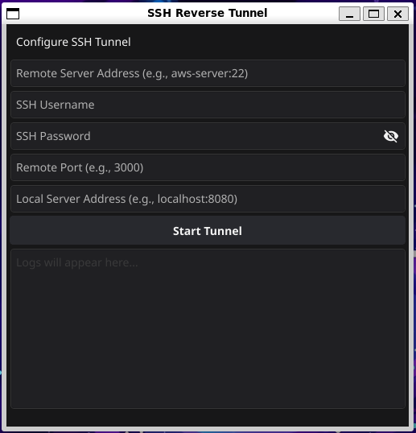

# Reverse SSH Tunnel with Golang for Local API Forwarding
<div align="center">
    
</div>


This project demonstrates how to use **Go** to create an **SSH reverse tunnel** to forward traffic from a remote server (e.g., an AWS EC2 instance) to a local server running on your machine. This is particularly useful for exposing local REST APIs to external clients securely.


## Features

- Establishes an SSH connection to a remote server.
- Forwards traffic received on a remote port to your local server.
- Supports **HTTP REST APIs** or any TCP-based protocols.
- Seamlessly handles requests and responses over the tunnel.


## Use Case

You can expose your local development server (e.g., `localhost:8080`) to the internet by forwarding traffic from an development server like AWS EC2 instance.

For example:

1. A client sends a request to `http://remote-server-address:3000/callback`.
2. The Go program forwards the request to your local server at `http://localhost:8080/callback`.
3. Your local server processes the request and sends the response back to the client.


## Prerequisites

- Go 1.18+ installed on your machine.
- An SSH-accessible remote server (e.g., AWS EC2).
- Local server running on your machine (e.g., `localhost:8080`).


## Installation

1. **Clone the repository**:

   ```bash
   git clone https://github.com/gerins/go-reverse-tunnel.git
   cd go-reverse-tunnel
   ```

2. **Install dependencies**:

   The project uses the `golang.org/x/crypto/ssh` and `fyne.io/fyne/v2` package.

   ```bash
    go mod tidy
   ```

3. **Run your local server** (example for Go save as local_server.go):

   ```go
   package main

   import (
       "fmt"
       "net/http"
   )

   func callbackHandler(w http.ResponseWriter, r *http.Request) {
       fmt.Println("Received callback request")
       fmt.Fprintf(w, "Callback received successfully!")
   }

   func main() {
       http.HandleFunc("/callback", callbackHandler)
       fmt.Println("Local server running on http://localhost:8080")
       http.ListenAndServe(":8080", nil)
   }
   ```
    
   Start the local server:

   ```bash
   go run local_server.go
   ```


## Usage


### Run the Reverse SSH Tunnel

Start the Go program:

```bash
go run main.go
```

Modify the configuration

- Replace `Remote Server Address` with the address of your remote server.
- Update the SSH username and password
- Set the local server example (`localhost:8080`) and remote port (`3000`).


The program will:

1. Connect to your remote SSH server.
2. Listen for incoming traffic on `0.0.0.0:3000` Remote server.
3. Forward requests to `localhost:8080`.


### Test the Forwarding

Send a request to the remote server:

```bash
curl http://remote-server-address:3000/callback
```

The local server will handle the request and respond:

```
Callback received successfully!
```

You will also see the output on your local server console:

```
Received callback request
```


## File Structure

```
reverse-ssh-tunnel/
│
├── main.go             # Reverse SSH tunnel code
└── README.md           # Project documentation
```


## Security Notes

- Replace password-based authentication with **SSH private key authentication** for production environments.
- Make sure the remote server's firewall/security group allows inbound traffic on the forwarded port (e.g., `3000`).


## Dependencies

- [fyne.io/fyne/v2](https://github.com/fyne-io/fyne)
- [golang.org/x/crypto/ssh](https://pkg.go.dev/golang.org/x/crypto/ssh)


## License

This project is licensed under the MIT License.


## Contributing

Pull requests are welcome! For major changes, please open an issue first to discuss what you'd like to change.


## Author

**Your Name**  
[GitHub](https://github.com/gerins) | [LinkedIn](https://www.linkedin.com/in/garin-prakoso-60244b1a2/)
