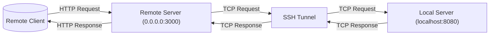

# Reverse SSH Tunnel with Golang for Local API Forwarding


This project demonstrates how to use **Go** to create an **SSH reverse tunnel** to forward traffic from a remote server (e.g., an AWS EC2 instance) to a local server running on your machine. This is particularly useful for exposing local REST APIs to external clients securely

---



---

## Features

- SSH reverse tunnel to expose your local server through a remote server.
- Works for any TCP-based protocol (e.g., HTTP REST APIs).
- CLI-based (no GUI dependencies).
- Supports **password** and **SSH key-based** authentication.
- Forward remote requests (e.g. `3000`) to your local port (e.g. `8080`).

---

## Use Case

Expose your local development server (e.g., `localhost:8080`) to the internet via an SSH-accessible server:

1. Client sends a request to `http://remote-server:3000/callback`
2. It is forwarded to your local server `http://localhost:8080/callback`
3. Your server processes and returns a response

---

## Prerequisites

- Go 1.18+
- An SSH-accessible remote server (e.g., AWS EC2)
- A running local server (e.g., on `localhost:8080`)
- Proper firewall/security group rules allowing the remote port

---

## Installation

```bash
git clone https://github.com/gerins/go-reverse-tunnel.git
cd go-reverse-tunnel
go mod tidy
````

---

## Example: Local Test Server

Create a file `local_server.go`:

```go
package main

import (
    "fmt"
    "net/http"
)

func callbackHandler(w http.ResponseWriter, r *http.Request) {
    fmt.Println("Received callback request")
    fmt.Fprintln(w, "Callback received successfully!")
}

func main() {
    http.HandleFunc("/callback", callbackHandler)
    fmt.Println("Local server running on http://localhost:8080")
    http.ListenAndServe(":8080", nil)
}
```

Run it:

```bash
go run local_server.go
```

---

## Usage

### 🔧 CLI Arguments

```bash
go run main.go \
  -remote=your-server.com:22 \
  -user=ubuntu \
  -pass=yourpassword \
  -rport=3000 \
  -laddr=localhost:8080
```

Or use SSH private key authentication:

```bash
go run main.go \
  -remote=your-server.com:22 \
  -user=ubuntu \
  -key=~/.ssh/id_rsa \
  -rport=3000 \
  -laddr=localhost:8080
```

### Required Flags

| Flag      | Description                                         |
|-----------|-----------------------------------------------------|
| `-remote` | Remote SSH server (e.g. `host:22`)                  |
| `-user`   | SSH username                                        |
| `-pass`   | SSH password (optional if using `-key`)             |
| `-key`    | SSH private key path (optional)                     |
| `-rport`  | Remote port to bind (e.g., `3000`)                  |
| `-laddr`  | Local server to forward to (e.g., `localhost:8080`) |

> 🔐 You **must** provide either `-pass` or `-key`.

---

## Example Test

```bash
curl http://your-server.com:3000/callback
```

Expected Output:

```
Callback received successfully!
```

Local server console will log:

```
Received callback request
```

---

## File Structure

```
go-reverse-tunnel/
├── main.go         # Reverse SSH tunnel CLI
├── local_server.go # Example local server
└── README.md       # Project documentation
```

---

## Security Notes

* Prefer **SSH key authentication** over passwords for production.
* Ensure your remote server’s firewall allows inbound traffic on the forwarded port (e.g., `3000`).

---

## Dependencies

* [golang.org/x/crypto/ssh](https://pkg.go.dev/golang.org/x/crypto/ssh)

---

## 📘 Documentation

`WIP`

---

## 🙌 Contributing

Pull requests are welcome! Please open an issue first to discuss major changes.

---

## 🔒 License

This project is licensed under the [MIT License](https://opensource.org/licenses/MIT). See `LICENSE` for details.

---

## ✍️ Author

**Garin Prakoso**
[GitHub](https://github.com/gerins) | [LinkedIn](https://www.linkedin.com/in/garin-prakoso-60244b1a2/)
